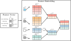
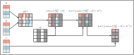
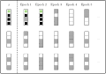

# NAIM 

---

1. [Installation](#installation)
2. [Usage](#usage)
   1. [Reproducing the experiments](#repr_exp)
   2. [Train & Test on your dataset](#new_exp)
      1. [Experiment declaration](#exp_decl)
      2. [Dataset preparation](#data_prep)
      3. [Experiment configuration](#exp_conf)
3. [Citation](#citation)

---

<p align="center" width="100%">

</p>

This document describes the implementation of *``Not Another Imputation Method´´* ([NAIM](https://arxiv.org/abs/2407.11540)) in Pytorch. 
NAIM is an architecture specifically designed for the analysis of tabular data, with a focus on addressing missing values in 
tabular data without the need for any imputation strategy.

By leveraging lookup tables, tailored for each type of feature, NAIM assigns a non-trainable vector to missing values, 
thus obtaining an embedded representation for every missing feature scenario.

<p align="center" width="100%">

</p>

Following this, through our innovative self-attention mechanism, all contributions from missing values in the 
attention matrix are ignored.

<p align="center" width="100%">

</p>

Ultimately, this approach to handling missing values paves the way for a novel method of data augmentation, inspired by 
methods used in classical image data augmentation. 
At every epoch, samples are randomly masked (where possible) to prevent co-adaptations among features and to enhance the 
model's generalization capability.

<p align="center" width="100%">

</p>

--- 

# Installation <div id='installation'/>
We used Python 3.9 for the development of the code.
To install the required packages, it is sufficient to run the following command:
```bash
pip install -r requirements.txt
```
and install a version of Pytorch compatible with the device available. We used torch==1.13.0.

---

# Usage <div id='usage'/>
The execution of the code heavily relies on Facebook's [Hydra](https://hydra.cc/) library. 
Specifically, through a multitude of configuration files that define every aspect of the experiment, it is possible to 
conduct the desired experiment without modifying the code. 
These configuration files have a hierarchical structure through which they are composed into a single configuration 
file that serves as input to the program. 
More specifically, the [`main.py`](./main.py) file will call the [`config.yaml`](./confs/config.yaml) file, from which 
the configuration files tree begins.

## Reproducing the experiments <div id='repr_exp'/>

All the dataset used in the paper are available on the [UCI Datasets](https://archive.ics.uci.edu/) repository and they are listed below:

<div style="display: block; margin: 0 auto; text-align: center">

| Dataset        | UCI Link   | Preprocessing |
|----------------|------------|---------------|
| ADULT          | [Link](https://archive.ics.uci.edu/ml/datasets/adult)| Sets joined   |
| BankMarketing  | [Link](https://archive.ics.uci.edu/ml/datasets/bank+marketing)| -             |
| OnlineShoppers | [Link](https://archive.ics.uci.edu/ml/datasets/Online+Shoppers+Purchasing+Intention+Dataset)| -             |
| SeismicBumps   | [Link](https://archive.ics.uci.edu/ml/datasets/seismic-bumps)| -             |
| Spambase       | [Link](https://archive.ics.uci.edu/ml/datasets/spambase)| -             |

</div>

To simplify the reproduction of the experiments done, it is possible to use the [`datasets_download.py`](./datasets_download.py) script to 
download the files. 
Therefore, thanks also to the [multirun](https://hydra.cc/docs/tutorials/basic/running_your_app/multi-run/) functionality of Hydra, to reproduce the NAIM experiments carried out in 
the paper it is sufficient to execute the following lines of code:

```python 
python datasets_download.py

python main.py -m experiment=classification_with_missing_generation experiment/databases@db=adult,bankmarketing,onlineshoppers,seismicbumps,spambase
```

These lines of code, assuming the initial configuration files have not been modified, enable the reproduction of the 
experiments presented in the paper using the NAIM model. 
These experiments generate different percentages of missing values in the training and testing sets, considering also 
all possible combinations of missing percentages in the different sets. 
Specifically, the percentages 0%, 5%, 10%, 25%, 50%, and 75% have been used as indicated by `missing_percentages=[0.0, 0.05, 0.1, 0.25, 0.5, 0.75]` in the [`classification_with_missing_generation.yaml`](./confs/experiment/classification_with_missing_generation.yaml) configuration file.

For each experiment, this code produces a folder named `<dataset-name>_<model-name>_<imputation-strategy>_with_missing_generation` which contains everything generated by the code. 
In particular, the following folders and files are present:

1. `cross_validation`: this folder contains a folder for each training fold, indicated as a composition of test and validation folds `<test-fold>_<val-fold>`, reporting the information on the train, validation and test sets in 3 separate csv files.
2. `preprocessing`: this folder contains all the preprocessing information divided into 3 main folders:
   1. `numerical_preprocessing`: in this folder, for each percentage of missing values considered, there is a csv file for each fold reporting the information on the preprocessing params of numerical features.
   2. `categorical_preprocessing`: in this folder, for each percentage of missing values considered, there is a csv file for each fold reporting the information on the preprocessing params of categorical features.
   3. `imputer`: in this folder, for each percentage of missing values considered, there are csv files for each fold with information on the imputation strategy applied to handle missing values and a pkl file containing the imputer fitted on the training data of the fold.
3. `saved_models`: this folder contains, for each percentage of missing values considered, a folder with the model's name that includes, for each fold, a csv file with the model's parameters and a pkl or pth file containing the trained model.
4. `predictions`: this folder contains, for each percentage of missing values considered, a folder that reports the predictions obtained from the training and validation sets and separately those of the test set. More specifically, there are two files for each fold reporting the predictions for the train and validation sets, called <test-fold>_<val-fold>_train and <test-fold>_<val-fold>_val respectively. Moreover, there are additional folders, one for each percentage of missing values considered, that report for each fold the predictions made on the test set (<test-fold>_<val-fold>_test).
5. `results`: this folder reports, for each percentage of missing values considered, the performance on the train, validation, and test sets separately. Specifically, for the training and validation sets and then, for each percentage of missing values considered, also for the test set, two folders named balanced and unbalanced containing the performance of the various sets are reported. These are presented in 3 separate files with increasing levels of averaging:
   1. `all_test_performance.csv`: this file presents the set's performance evaluated for each fold and each class.
   2. `classes_average_performance.csv`: this file, computing the average performance of the folds, contains the performance for each class.
   3. `set_average_performance.csv`: this file, calculating the average performance of the folds and the classes, contains the average performance of the set.
6. `config.yaml`: this file contains the configuration file used as input for the experiment.
7. `<experiment-name>.log`: this is the log file of the experiment.

## Train & Test on your dataset <div id='new_exp'/>

### Experiment declaration  <div id='exp_decl'/>

As mentioned above, the experiment configuration file is created at the time of code execution starting from the 
[`config.yaml`](./confs/config.yaml) file, in which the configuration file for the experiment to be performed is declared, 
along with the paths from which to load data (`data_path`) and where to save the outputs (`output_path`).

```yaml
data_path: ./datasets # Path where the datasets are stored
output_path: ./outputs # Path where the outputs will be saved

defaults: # DO NOT CHANGE
  - _self_ # DO NOT CHANGE
  - experiment: classification # Experiment to perform, classification or classification_with_missing_generation
```

The possible options for the `experiment` parameter are [`classification`](./confs/experiment/classification.yaml) and [`classification_with_missing_generation`](./confs/experiment/classification_with_missing_generation.yaml).

### Dataset preparation <div id='data_prep'/>

To prepare a dataset for the analysis with this code, it is sufficient to prepare a configuration file, specific for the 
dataset, similar to those already provided in the folder [`./confs/experiment/databases`](./confs/experiment/databases).
The path to the data must be specified in the `path` parameter in the dataset's configuration file.
Thanks to the [interpolation](https://hydra.cc/docs/patterns/specializing_config/) functionality of Hydra the path can be composed using the `${data_path}` interpolation key, which refers to the `data_path` parameter of the [`config.yaml`](./confs/config.yaml) file.
Once the dataset configuration file is prepared, it is important that it is placed in the same folder [`./confs/experiment/databases`](./confs/experiment/databases) and that in the file [`classification.yaml`](./confs/experiment/classification.yaml) 
the name of the created configuration file is reported at the `databases@db` key. 
In particular, it is important that the dataset configuration file is structured as follows:

```yaml 
_target_: CMC_utils.datasets.ClassificationDataset # DO NOT CHANGE
_convert_: all # DO NOT CHANGE

name: <dataset-name> # Name of the dataset
db_type: tabular # DO NOT CHANGE

classes: ["<class-1-name>", ..., "<class-n-name>"] # List of the classes
label_type: multiclass # multiclass or binary (SPIEGARE BINARY)

task: classification # DO NOT CHANGE

path: ${data_path}/<relative-path-to-file> # Relative path to the file, KEEP ${data_path}/... to compose the path condisering the data_path parameter defined in the 'config.yaml' file.

columns: # Dictionary containing features names as keys and their types as values # DO NOT REMOVE
  <ID-name>:        id             # Name of the ID column if present, DO NOT CHANGE THE VALUE, NAME CORRECTLY THE TARGET VARIABLE
  <feature-1-name>: <feature-type> # int, float or category 
  <feature-2-name>: <feature-type> # int, float or category
  <feature-3-name>: <feature-type> # int, float or category
  # Other features to be inserted
  <label-name>:     target         # Name of the target column containing the classes, DO NOT CHANGE THE VALUE, NAME CORRECTLY THE TARGET VARIABLE
    
# here any pd.read_csv or pd.read_excel input parameter to correctly load the data can be added (e.g., na_values, header, index_col)
pandas_load_kwargs:
  na_values: [ "?" ]
  header: 0
  index_col: 0

dataset_class: # DO NOT CHANGE
  _target_: CMC_utils.datasets.SupervisedTabularDatasetTorch # DO NOT CHANGE
  _convert_: all # DO NOT CHANGE
```

In the `columns` definition, `id` and `target` feature types can be used to define the ID and classes columns respectively.

### Experiment configuration <div id='exp_conf'/>

Here we present the [`classification.yaml`](./confs/experiment/classification.yaml) configuration file, which defines the specifics for conducting a 
classification pipeline using all the available data.
It is also available the [`classification_with_missing_generation.yaml`](./confs/experiment/classification_with_missing_generation.yaml) configuration file, which defines the specifics for the experiment of the paper,
where predefined percentages of missing values are randomly generated in the train and test set.
To execute the experiment of the paper, you need to set the `experiment` parameter in the [`config.yaml`](./confs/config.yaml) file to `classification_with_missing_generation`.
You can also customize the missing percentages values to be tested by modifying the `missing_percentages` parameter in the [`classification_with_missing_generation.yaml`](./confs/experiment/classification_with_missing_generation.yaml) file.

The [`classification.yaml`](./confs/experiment/classification.yaml) file is the primary file where all the parameters of the experiment are defined. 
It begins with some general information, such as the name of the experiment, the pipeline to be executed, the seed for 
randomness control, training verbosity, and the percentages of missing values to be tested. 

```yaml
experiment_name: ${db.name}_${model.name}_${preprocessing.imputer.method}_with_missing_generation # DO NOT CHANGE
pipeline: missing # DO NOT CHANGE

seed: 42 # Seed for randomness control
verbose: 1 # 0 or 1, verbosity of the training

continue_experiment: False # True or False, if the experiment should be continued from where it was interrupted
```

> NOTE: In case an experiment should be interrupted, voluntarily or not, it is possible to resume it from where it was interrupted by setting the `continue_experiment` parameter to `True`.

Then, all other necessary configuration files for the different parts of the experiment are declared.
It is possible to define:
- the dataset to analyse (`databases@db`); 
- the cross-validation strategies to use for the test (`cross_validation@test_cv`) and 
validation (`cross_validation@val_cv`) sets separately;
- the preprocessing steps to be performed for the numerical (`preprocessing/numerical`), categorical (`preprocessing/categorical`) and missing features (`preprocessing/imputer`) ;
- the model to be used (`model`).
- the metric to be used in the early stopping process (`metric@train.set_metrics.<metric-name>`) and in the performance evaluation (`metric@performance_metrics.<metric-name>`).

```yaml
defaults: # DO NOT CHANGE
  - _self_ # DO NOT CHANGE
  - paths@: default # DO NOT CHANGE
  - paths: experiment_paths # DO NOT CHANGE
    
  - databases@db: <dataset-configuration-file-name> # Name of the configuration file of the dataset

  - cross_validation@test_cv: stratifiedkfold # Cross-validation strategy for the test set
  - cross_validation@val_cv: holdout          # Cross-validation strategy for the validation set

  - preprocessing/numerical: normalize # normalize or standardize
  - preprocessing/categorical: categorical_encode # categorical_encode or one_hot_encode
  - preprocessing/imputer: no_imputation # simple or knn or iterative or no_imputation
  
  - model_type_params@dl_params: dl_params # DO NOT CHANGE
  - model_type_params@ml_params: ml_params # DO NOT CHANGE
    
  - model: naim # Name of the model to use

  - model_type_params@train.dl_params: dl_params # DO NOT CHANGE
    
  - initializer@train.initializer: xavier_uniform # DO NOT CHANGE
  - loss@train.loss.CE: cross_entropy             # DO NOT CHANGE
  - regularizer@train.regularizer.l1: l1          # DO NOT CHANGE
  - regularizer@train.regularizer.l2: l2          # DO NOT CHANGE
  - optimizer@train.optimizer: adam               # DO NOT CHANGE
  - train_utils@train.manager: train_manager      # DO NOT CHANGE
    
  - metric@train.set_metrics.auc: auc # Metric to use for the early stopping
    
  - metric@performance_metrics.auc: auc # Metric to use for the performance evaluation
  - metric@performance_metrics.accuracy: accuracy # Metric to use for the performance evaluation
  - metric@performance_metrics.recall: recall # Metric to use for the performance evaluation
  - metric@performance_metrics.precision: precision # Metric to use for the performance evaluation
  - metric@performance_metrics.f1_score: f1_score # Metric to use for the performance evaluation
```

The possible options for these parts are the files contained in the folders listed in the table below.  

| Params                   | Keys                                                                                | Options                                                                                                                                                                                                                                                                                                                                                                                                                                                                                                                                                                                                |
|--------------------------|-------------------------------------------------------------------------------------|--------------------------------------------------------------------------------------------------------------------------------------------------------------------------------------------------------------------------------------------------------------------------------------------------------------------------------------------------------------------------------------------------------------------------------------------------------------------------------------------------------------------------------------------------------------------------------------------------------|
| Dataset                  | `databases@db`                                                                      | [adult](./confs/experiment/databases/adult.yaml), [bankmarketing](./confs/experiment/databases/bankmarketing.yaml), [onlineshoppers](./confs/experiment/databases/onlineshoppers.yaml), [seismicbumps](./confs/experiment/databases/seismicbumps.yaml), [spambase](./confs/experiment/databases/spambase.yaml)                                                                                                                                                                                                                                                                                         |
| Cross Validation         | `cross_validation@test_cv` `cross_validation@val_cv`                                | [bootstrap](./confs/experiment/cross_validation/bootstrap.yaml), [holdout](./confs/experiment/cross_validation/holdout.yaml), [kfold](./confs/experiment/cross_validation/kfold.yaml), [leave_one_out](./confs/experiment/cross_validation/leave_one_out.yaml), [predefined](./confs/experiment/cross_validation/predefined.yaml), [stratifiedkfold](./confs/experiment/cross_validation/stratifiedkfold.yaml)                                                                                                                                                                                         |
| Numerical Preprocessing  | `preprocessing/numerical`                                                           | [normalize](./confs/experiment/preprocessing/numerical/normalize.yaml), [standardize](./confs/experiment/preprocessing/numerical/standardize.yaml)                                                                                                                                                                                                                                                                                                                                                                                                                                                     |
| Categorical Preprocessing | `preprocessing/categorical`                                                         | [categorical_encode](./confs/experiment/preprocessing/categorical/categorical_encode.yaml), [one_hot_encode](./confs/experiment/preprocessing/categorical/one_hot_encode.yaml)                                                                                                                                                                                                                                                                                                                                                                                                                         |
| Imputation Strategy      | `preprocessing/imputer`                                                             | [simple](./confs/experiment/preprocessing/imputer/simple.yaml), [knn](./confs/experiment/preprocessing/imputer/knn.yaml), [iterative](./confs/experiment/preprocessing/imputer/iterative.yaml), [no_imputation](./confs/experiment/preprocessing/imputer/no_imputation.yaml)                                                                                                                                                                                                                                                                                                                           |
| Model                    | `model`                                                                             | [naim](./confs/experiment/model/naim.yaml), [adaboost](./confs/experiment/model/adaboost.yaml), [dt](./confs/experiment/model/dt.yaml), [fttransformer](./confs/experiment/model/fttransformer.yaml), [histgradientboostingtree](./confs/experiment/model/histgradientboostingtree.yaml), [mlp_sklearn](./confs/experiment/model/mlp_sklearn.yaml), [rf](./confs/experiment/model/rf.yaml), [svm](./confs/experiment/model/svm.yaml), [tabnet](./confs/experiment/model/tabnet.yaml), [tabtransformer](./confs/experiment/model/tabtransformer.yaml), [xgboost](./confs/experiment/model/xgboost.yaml) |
| Metrics                  | `metric@train.set_metrics.<metric-name>` `metric@performance_metrics.<metric-name>` | [auc](./confs/experiment/metric/auc.yaml), [accuracy](./confs/experiment/metric/accuracy.yaml), [recall](./confs/experiment/metric/recall.yaml), [precision](./confs/experiment/metric/precision.yaml), [f1_score](./confs/experiment/metric/f1_score.yaml)                                                                                                                                                                                                                                                                                                                                            |

To modify some of the hyperparameters of the models, it is possible to modify the [`ml_params`](./confs/experiment/model_type_params/ml_params.yaml) and [`dl_params`](./confs/experiment/model_type_params/dl_params.yaml) files.
For the ML models it is possible do define the number of estimators (`n_estimators`), whereas for the DL models it is possible to define the number of epochs (`max_epochs`), the warm-up number of epochs (`min_epochs`),
the batch_size (`batch_size`), the early stopping's (`early_stopping_patience`) and the scheduler's (`scheduler_patience`) patience and their tolerance for performance improvement (`performance_tolerance`), the device to use for training (`device`).
It is also possible to define the learning rates to be tested (`learning_rates`), but to be compatible with some of the competitor available in the models list, it is necessary to define also the initial learning rate (`init_learning_rate`), and the final learning rate (`end_learning_rate`). 

#### [./confs/experiment/model_type_params/ml_params.yaml](./confs/experiment/model_type_params/ml_params.yaml)
```yaml
n_estimators: 100 # Number of estimators for the ML models
```

#### [./confs/experiment/model_type_params/dl_params.yaml](./confs/experiment/model_type_params/dl_params.yaml)
```yaml
max_epochs: 1500 # Maximum number of epochs

min_epochs: 50 # Warm-up number of epochs 

batch_size: 32 # Batch size

init_learning_rate: 1e-3 # Initial learning rate

end_learning_rate: 1e-8 # Final learning rate

learning_rates: [1e-3, 1e-4, 1e-5, 1e-6, 1e-7] # Learning rates for the scheduler

early_stopping_patience: 50 # Patience for the early stopping

scheduler_patience: 25 # Patience for the scheduler 

performance_tolerance: 1e-3 # Tolerance for the performance improvement

verbose: ${verbose} # DO NOT CHANGE

verbose_batch: 0 # 0 or 1 or ${verbose}, verbosity of the training for the batch

device: cuda # cpu or cuda, device to use for training
```


For a single experiment, this code produces a folder named `<dataset-name>_<model-name>_<imputation-strategy>` which contains everything generated by the code. 
In particular, the following folders and files are present:

1. `cross_validation`: this folder contains a folder for each training fold, indicated as a composition of test and validation folds `<test-fold>_<val-fold>`, reporting the information on the train, validation and test sets in 3 separate csv files.
2. `preprocessing`: this folder contains all the preprocessing information divided into 3 main folders:
   1. `numerical_preprocessing`: in this folder there is a csv file for each fold reporting the information about the preprocessing params of numerical features.
   2. `categorical_preprocessing`: in this folder there is a csv file for each fold reporting the information about the preprocessing params of categorical features.
   3. `imputer`: in this folder there are a csv file for each fold reporting the information on the imputation strategy applied to handle missing values and a pkl file containing the imputer fitted on the training data.
3. `saved_models`: this folder contains a folder, named as the model, that for each fold includes a csv file with the model's parameters and a pkl or pth file containing the trained model.
4. `predictions`: this folder contains a folder that reports the predictions obtained from the train and validation and test sets separately. 
More specifically, for each fold there are 3 files reporting the predictions for the train, validation and test sets, called `<test-fold>_<val-fold>_train`, `<test-fold>_<val-fold>_val` and `<test-fold>_<val-fold>_test` respectively.
5. `results`: this folder reports the performance on the train, validation, and test sets separately. Specifically, for each set two folders, named `balanced` and `unbalanced`, containing the performance of the various sets are reported. The performance are presented in 3 separate files with increasing levels of averaging:
   1. `all_test_performance.csv`: this file presents the set's performance evaluated for each fold and each class.
   2. `classes_average_performance.csv`: this file, computing the average performance of the folds, contains the performance for each class.
   3. `set_average_performance.csv`: this file, calculating the average performance of the folds and the classes, contains the average performance of the respective set.
6. `config.yaml`: this file contains the configuration file used as input for the experiment.
7. `<experiment-name>.log`: this is the log file of the experiment. 

---
# Contact <div id='contact'/>

For any questions, please contact [camillomaria.caruso@unicampus.it](mailto:camillomaria.caruso@unicampus.it) and [valerio.guarrasi@unicampus.it](mailto:valerio.guarrasi@unicampus.it).

---

# Citation <div id='citation'/>

```bibtex
@misc{caruso2024imputationmethodtransformerbasedmodel,
      title={Not Another Imputation Method: A Transformer-based Model for Missing Values in Tabular Datasets}, 
      author={Camillo Maria Caruso and Paolo Soda and Valerio Guarrasi},
      year={2024},
      eprint={2407.11540},
      archivePrefix={arXiv},
      primaryClass={cs.LG},
      url={https://arxiv.org/abs/2407.11540}, 
}
```

